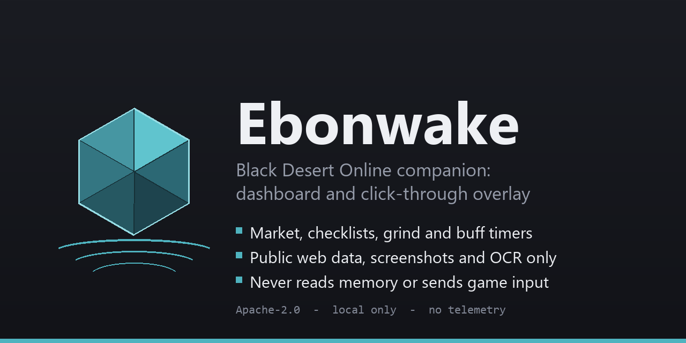
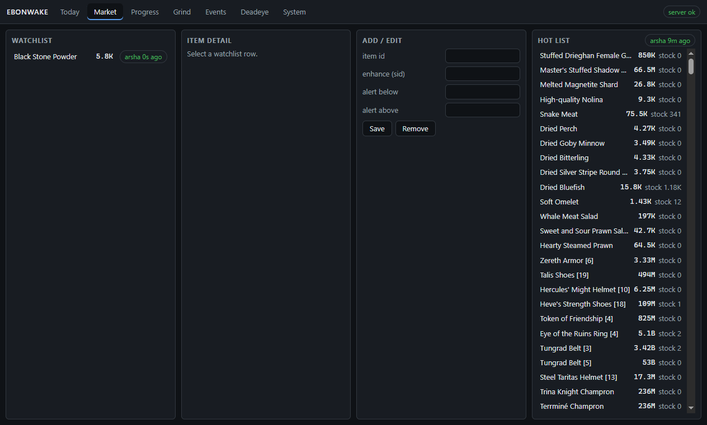
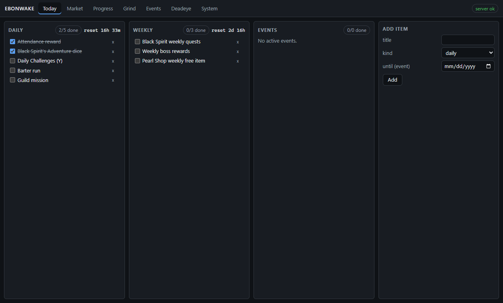
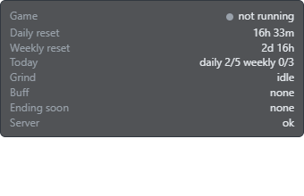

<p align="center">
  
</p>

# Ebonwake

**A Black Desert Online companion that never touches the game.**

[](../../actions/workflows/ci.yml)
[](LICENSE)
[](.github/workflows/ci.yml)
[](app/package.json)
[](#requirements)

Ebonwake is a compact tabbed dashboard plus a transparent, click-through
overlay for one Black Desert Online player, fed by a small local server on
`127.0.0.1`. It runs beside the game, not inside it.

> **ToS safety, in one line: Ebonwake does no memory reading, no injection and
> no input automation - ever.** See [What it never does](#what-it-never-does)
> and [`docs/research/0001-bdo-data-and-tos.md`](docs/research/0001-bdo-data-and-tos.md).



<sub>Dashboard, Market tab. Captured by the app's own desktop self-test
(`EW_SELFTEST`), which drives only Ebonwake's windows - not from the game.</sub>

## Contents

- [Features](#features)
- [What it never does](#what-it-never-does)
- [Quick start](#quick-start)
- [Privacy](#privacy)
- [How it works](#how-it-works)
- [Status](#status)
- [Contributing](#contributing)
- [License and disclaimer](#license-and-disclaimer)

## Features

| Tab | What it does |
|---|---|
| **Today** | Daily and weekly checklist with NA reset countdowns, login events, dice |
| **Market** | Central Market prices, history, order book and alert thresholds from the public arsha.io API - read-only, cached, with backoff |
| **Progress** | Main-story, season-pass and gear tracks; optional public profile card (BDO-REST-API) |
| **Grind** | Grind session log, silver per hour, buff timers |
| **Events** | Coupon, event and Twitch-drop tracker with expiries |
| **Deadeye** | Build notes and an enhancement plan |
| **System** | Server health, game state (not running / running / logged in) from the client's session log, screenshot OCR |

The **overlay** shows the reset clocks, today's checklist count, the grind
session, the active buff and whatever ends soonest. It is toggled with
`Ctrl+Alt+E`; `Ctrl+Alt+D` brings the dashboard back.

<p>
  
  
</p>

## What it never does

Black Desert's anti-cheat (XIGNCODE3 on NA/EU) and its operational policy ban
unauthorized programs and every macro. Ebonwake's boundary is fixed and is not
a setting:

- **No memory reading or writing** of the game process.
- **No injection** - no DLLs, no D3D/DXGI hooks, nothing loaded into the client.
- **No input automation** - no synthetic keys or clicks to the game window, no
  macros, no AFK helpers, and no screen-reading that leads to input.
- **No packet access** and **no client file changes**.
- **No authenticated market actions** - market calls are read-only `GET`s.

What it does read: the public arsha.io v2 market API, the public BDO-REST-API
profile endpoint, a tail of the client's own session log (running / logged in /
disconnected only), screenshots **you** take (OCR), and what you type.

The overlay is a separate always-on-top Electron window with
`setIgnoreMouseEvents(true)`, toggled by Electron's `globalShortcut`. No
low-level keyboard hooks. Run the game borderless or windowed. Long form:
[`docs/research/0001-bdo-data-and-tos.md`](docs/research/0001-bdo-data-and-tos.md).

## Quick start

```
git clone <https URL from this page's Code button> Ebonwake
cd Ebonwake
python tools/install_hooks.py      # once: wires the tracked git hooks
python -m server.ew                # local server on 127.0.0.1:8940
npm install --prefix app           # once, installs Electron
npm start --prefix app             # dashboard + overlay (Ctrl+Alt+E toggles overlay)
```

Per-host settings (hotkeys, market watchlist, optional profile family name, OCR
engine) go in `config/local.json`, copied from
[`config/local.example.json`](config/local.example.json). It is gitignored.

### Requirements

- **Windows** (the game and its paths are Windows-only)
- **Python 3.11+**, standard library only for the server and tools
- **Node 20+** for the Electron app
- Optional: Tesseract for screenshot OCR (Windows OCR is the fallback)

### Test

```
python -m pytest -q
npm test --prefix app
```

The JavaScript tests run under `node --test`; no Electron is needed. CI runs
both on every push.

## Privacy

- **No telemetry, no accounts, no analytics.** Nothing is sent anywhere except
  the public read-only API calls above.
- The server binds `127.0.0.1` only.
- Your checklists, notes, grind logs and screenshot results stay in the local,
  gitignored `ops/runtime/` directory.
- The profile card sends only the family name you configure, and only to the
  public profile API.
- API keys, if you add any, live in user environment variables and are
  referenced - never stored - from `config/local.json`.

## How it works

```
server/ew/   Python stdlib server: API, dashboard assets, overlay SSE
app/         Electron: dashboard window + transparent click-through overlay
tools/       ETA log, lane driver, leak sweep, hook installer
ops/         vendored fleet kit (do not edit), runtime state (gitignored)
docs/        spec, plans, research, ADRs
```

Decisions live in [`docs/adr/`](docs/adr/) and the spec in
[`docs/design/0001-ebonwake-spec.md`](docs/design/0001-ebonwake-spec.md).

Ebonwake is built by Claude Code agent sessions under the rules in
[`CLAUDE.md`](CLAUDE.md): spec first, failing test first, an independent
verifier before any done-claim, and a leak sweep on every commit and push.

## Status

Shipped: every tab above plus the overlay, game-state watch, screenshot OCR,
official-notice import, world bosses, enhancement / market / grind planners and
a start-on-login package. Open: the self-running work loop (built; scheduled
task read-back pending). The open-work queue is
[`docs/plans/ROADMAP.md`](docs/plans/ROADMAP.md). There is no packaged release
yet; run from a clone.

## Contributing

Read [`CONTRIBUTING.md`](CONTRIBUTING.md) first - the game-safety boundary is
stricter than usual and a pull request is measured against it. Also:
[`CODE_OF_CONDUCT.md`](CODE_OF_CONDUCT.md) and [`SECURITY.md`](SECURITY.md)
(private vulnerability reporting; cheats and anti-cheat bypasses are out of
scope).

## License and disclaimer

Apache License 2.0. See [`LICENSE`](LICENSE) and [`NOTICE`](NOTICE).

**Ebonwake is an unofficial fan project. It is not affiliated with, endorsed
by, or connected to Pearl Abyss.** Black Desert and Black Desert Online are
trademarks of Pearl Abyss Corp.; all other trademarks belong to their
respective owners.

**No game assets or game data are redistributed.** Market data is fetched at
run time from public APIs; everything else is this project's own code or what
you enter yourself.
